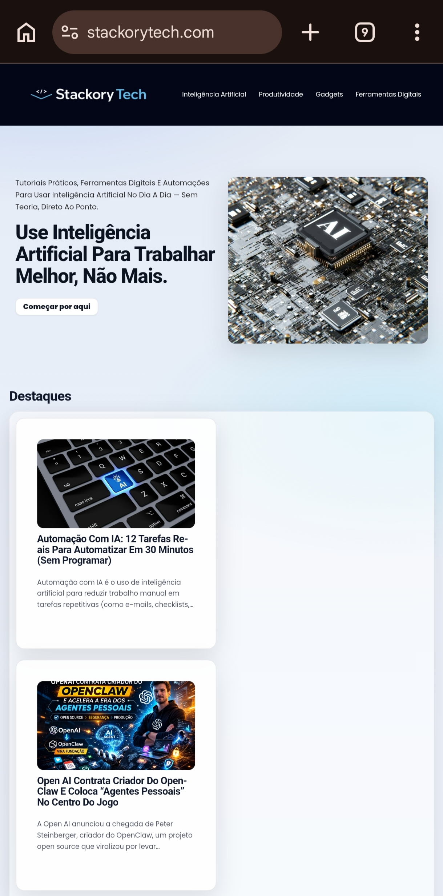

# 🚀 Stackory Tech — Production Website Engineering Case Study

> Live production engineering case study demonstrating real-world frontend optimization, performance tuning and SEO architecture decisions.

## 🌐 Live Production
https://stackorytech.com

## Engineering Scope

Production Frontend Engineering focused on real-world debugging,
performance optimization, responsive architecture and SEO-driven development.

This project represents engineering work performed on a live production environment
with real users, real traffic and continuous deployment iterations.

### 🧠 Real Engineering Context

This repository documents continuous optimization of a live production website, including frontend debugging, UX refinement, performance tuning and SEO architecture decisions.

## 🎯 Engineering Focus
Frontend Engineering • SEO Architecture • Performance Optimization • Production Debugging

## 📌 About This Repository
This repository documents a real production website engineering workflow, including continuous optimization, debugging, performance tuning and SEO architecture improvements.

> Real production website engineering case study demonstrating frontend optimization, SEO architecture and continuous deployment workflow.

🌐 **Live Production Website**
👉 https://stackorytech.com

---

## 🧩 Engineering Challenges

- Mobile layout instability across devices
- Content hierarchy affecting readability
- Performance bottlenecks during navigation
- SEO structure not optimized for scalability

---
## 🧠 Engineering Highlights

- Production website running with continuous updates
- Real user traffic environment
- SEO architecture designed for scalability
- Performance-first frontend engineering
- Continuous debugging and optimization workflow

## 📸 Production Preview

👉 **[Visit StackoryTech.com](https://stackorytech.com)**

### 🌐 Live Demo
👉 https://stackorytech.com

---

## 📌 Project Overview

Stackory Tech is a real production website focused on Artificial Intelligence, productivity systems and digital tools.

This project demonstrates real-world frontend debugging, responsive design optimization and SEO-oriented development.

---

Engineering Contributions

- Designed website architecture and content structure
- Implemented responsive layout adjustments
- Performed frontend debugging and UI refinements
- Optimized performance and SEO structure
- Managed real production deployment and updates

---

## ⚙️ Tech Stack

- WordPress (Gutenberg Block Editor)
- HTML / CSS customization
- Responsive Design
- Frontend Debugging
- UI/UX Optimization
- SEO Optimization (Rank Math)
- Performance Optimization

---

## 📊 Before / After Impact

**Before**
- Mobile layout instability
- Inconsistent spacing
- Weak content hierarchy
- Performance bottlenecks

**After**
- Stable responsive layout
- Improved UX structure
- Faster loading performance
- SEO-ready content system

---

## ⚡ Real Problems Solved

- Fixed mobile layout breaking on homepage grid sections
- Improved content hierarchy and visual spacing
- Optimized responsive behavior across devices
- Implemented SEO structure using RankMath
- Reduced visual clutter and improved readability
- Converted blog layout into production-ready structure

This repository represents continuous real-world iteration instead of a static tutorial project.

---

## 📊 Metrics & Outcomes

- Improved mobile layout stability
- Increased content readability and hierarchy
- SEO-ready publishing workflow
- Production-ready blog structure

---

## 📈 Engineering Impact

- Converted content blog into scalable platform
- Established structured SEO publishing workflow
- Improved UX consistency across mobile devices
- Enabled continuous performance optimization cycle

---

## 🔄 Development Approach

This project follows iterative real-world development, focusing on continuous improvement, performance optimization and production stability rather than one-time delivery.

---

## 🧠 Engineering Philosophy

Focus on solving real production problems instead of building isolated tutorial projects.

Engineering decisions prioritize maintainability, performance,
user experience and long-term scalability.

---

## 👩‍💻 Role & Responsibilities

- Sole engineer responsible for frontend optimization and site evolution
- Continuous production debugging and UI refinement
- SEO architecture implementation and monitoring
- Performance tuning and responsive behavior improvements
- Production deployment management and iterative releases
